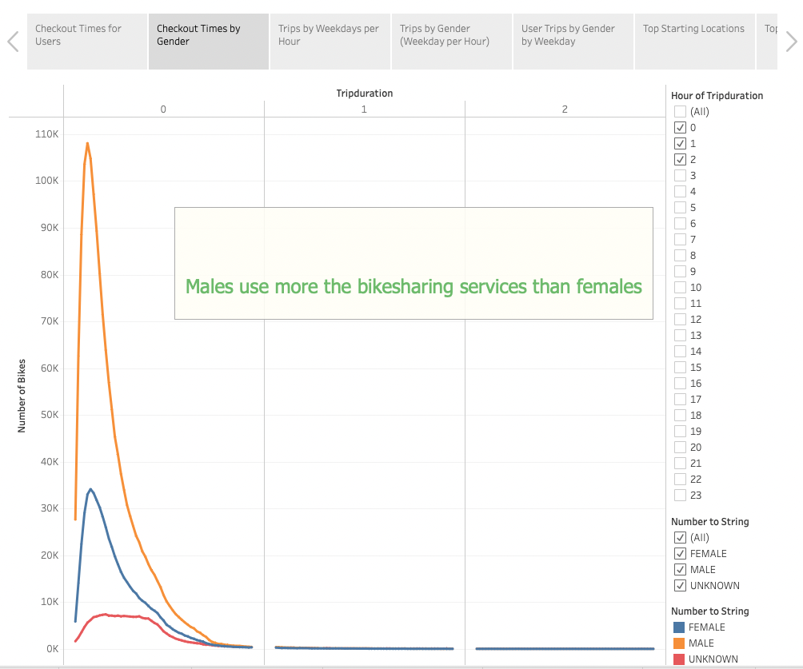

# bikesharing

The purpuse of this analysis is to create a story that convice investors that the bike-sharing program in Des Moines will be a good investment.

We will show the investors the NYC Story with Real Data

 With this information we were able to show real  data to the investors where the bike-sharing services have been successful.
 We were able to show them the busiest time of the day, the checkout times by Gender, the amount of trips by weekday per hour. We also shared the Top Starting and Ending Locations which will be very important to focus in Des Moine.
 At the end we were able to deliver a complete analysis in order for the investors to make their decision. 

 [link to dashboard](https://public.tableau.com/authoring/Challenge-citibike/CheckoutTimesforUsers2/NYC%20Story#1)